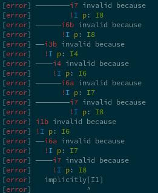

# A scala compiler plugin for more concise errors

This plugin removes some of the redundancy of the compiler output and prints
additional info for implicit resolution errors.

# Usage

Include this line in your `build.sbt` (_not_ `project/plugins.sbt`!!):

```sbt
addCompilerPlugin("io.tryp" % "splain" % "0.5.6" cross CrossVersion.patch)
```

If you want to support scala versions both newer and older than `2.12.5`, use:

```sbt
libraryDependencies += {
  val v =
    if (scalaVersion.value.replaceFirst(raw"\.(\d)$$",".0$1") <= "2.12.04") "0.4.1"
    else "0.5.6"
  ("io.tryp" %% "splain" % v cross CrossVersion.patch).withConfigurations(Some("plugin->default(compile)"))
}
```

# Configuration
The plugin can be configured via compiler plugin parameters with the format:
```
-P:splain:<param>[:<value>]
```
`param` can be one of the following:
* `all`
* `infix`
* `foundreq`
* `implicits`
* `bounds` (default off)
* `color`
* `breakinfix` (default 0)
* `tree`
* `compact` (default off)
* `boundsimplicits`
* `truncrefined` (default 0)
* `rewrite` (string)
* `keepmodules` (default 0)

`value` can either be `true` or `false`. If omitted, the default is `true` for
both value and parameter.

The parameter `all` can be used to deactivate all features.

The parameters can be applied like this:

```sbt
scalacOptions += "-P:splain:implicits:false"
```

# infix types
Instead of `shapeless.::[A, HNil]`, prints `A :: HNil`.

# found/required types
Rather than printing up to four types, only the dealiased types are shown as a colored diff:


special consideration for `shapeless.Record`:


In the case of refined types in the form of `Client with Database with
Publisher`, the types will be matched with each other and a missing or surplus
type will be indicated by a `<none>` label.

# implicit resolution chains
When an implicit is not found, only the outermost error at the invocation point
is printed. This can be expanded with the compiler flag `-Xlog-implicits`, but
that also shows all invalid implicits for parameters that have been resolved
successfully.
This feature prints a compact list of all involved implicits:


Here, `!I` stands for *could not find implicit value*, the name of the implicit
parameter is in yellow, and its type in green.

If the parameter `tree` is set, the candidates will be indented according to their nesting level:



If the parameter `compact` is set, only the first and last implicit in a chain will be printed.

If the parameter `boundsimplicits` is set to false, any **nonconformant bounds** errors will be suppressed.

For comparison, this is the regular compiler output for this case (with
formatted types):

```
[info] unit/src/basic.scala:35: f is not a valid implicit value for
splain.ImplicitChain.T2 because:
[info] hasMatchingSymbol reported error: could not find implicit value for
parameter impPar2: (D *** (C *** String)) >:< ((C,D,C) *** D)
[info]   implicitly[T1]
[info]             ^
[info] unit/src/basic.scala:35: g is not a valid implicit value for
splain.ImplicitChain.T1 because:
[info] hasMatchingSymbol reported error: could not find implicit value for
parameter impPar1: D *** ((C >:< C) *** (D => Unit))
[info]   implicitly[T1]
[info]             ^
[error] unit/src/basic.scala:35: could not find implicit value for
parameter e: (C *** D) >:< C with D {type A = D; type B = C}
[error]   implicitly[T1]

```

# infix type and type argument line breaking

If the parameter `breakinfix` is given and greater than 0, types longer than
that number will be split into multiple lines:

```
implicit error;
!I e: String
f invalid because
!I impPar4: List[
  (
    VeryLongTypeName ::::
    VeryLongTypeName ::::
    VeryLongTypeName ::::
    VeryLongTypeName
  )
  ::::
  (Short :::: Short) ::::
  (
    VeryLongTypeName ::::
    VeryLongTypeName ::::
    VeryLongTypeName ::::
    VeryLongTypeName
  )
  ::::
  VeryLongTypeName ::::
  VeryLongTypeName ::::
  VeryLongTypeName ::::
  VeryLongTypeName
]
```

# truncating refined types

A type of the shape `T { type A = X; type B = Y }` will be displayed as `T {...}` if the parameter `truncrefined` is set
to a value `/= 0` and the refinement's length is greater than the value.

# truncating module paths

Default behaviour when printing type names is to omit the whole module path and only print the last segment.
Two options modify this behaviour:

## regex rewrite

The option `rewrite` takes a string that is parsed as a `;`-delimited list of regexes and optional replacements.

For example:

```
-P:splain:rewrite:cats\\.data/cd;.Type
```

This parses as two rewrite items:

* transform `cats.data` into `cd`
* delete all occurences of `.Type`

If a slash is present, the string following it will be used as a replacement for the matched text.
If it is absent, the empty string is substituted.

## dropping module segments by count

The option `keepmodules` determines how many segments of the module path before the type name will be displayed, but
only if the `rewrite` mechanism hasn't changed anything.

So with `-P:splain:keepmodules:2`, the qualified type `cats.free.FreeT.Suspend` will be displayed as `free.FreeT.Suspend`, keeping the two segments `free.FreeT` before the type name.
The default is `0`, so only the type name itself will be displayed
